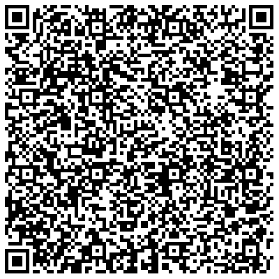

# elektronisch lesbarer Schülerausweis
Der Ausweis enthält einen RSA verschlüsseltes JSON, welches wichtige Daten beinhaltet. Über eine spezielle Webapp kann der Ausweis ausgelesen werden. Exemplarisch finden Sie diese WebApp in einem Docker Container z.B. unter [https://130.61.61.100:8082/login.html](https://130.61.61.100:8082/login.html)!


## Beispiel


## Konfiguration
Die notwendigen Schlüssel befinden sich im Verzeichnis config.


- **ausweis.private** RSA Key
- **ausweis.xml** XML Version des RSA Keys (wird für die Powershell Scripte benötigt)
- **server.cert** und **server.key** für die https-Verschlüsselung notwendig

## Docker Container
Der Docker Container arbeitet default auf Port 8080 über https. Der RSA Schlüssel **ausweis.private** und die SSH Schlüssel **server.cert** und **server.key** liegen außerhab des Docker Containers in einem Volume, welche die entsprechenden Dateien enthält. Daher muss der Container wie folgt gestartet werden.

```
docker run --rm -v c:/config:/usr/src/app/config -it -p 8080:8080 service.joerg-tuttas.de:5555/root/schuelerausweis
```

## Ideen
- Upload / Download von einem Bild in der Schüleransicht
