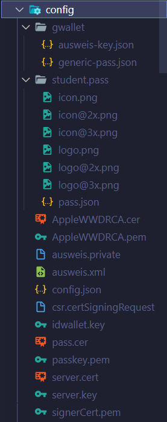

# elektronisch lesbarer Schülerausweis

Die Hauptentwicklungspunkte bei dieser Anwendung war es einen **elektronisch lesbaren** und **fälschungssicheren** Schülerausweis zu erzeugen!

Der Ausweis enthält daher ein als RSA verschlüsseltes JSON, welches die folgenden Daten beinhaltet.

```JSON
{
  "nn": "Mustermann", // Nachname
  "vn": "Max", // Vorname
  "kl": "FIAE20J", // Klasse
  "v": "2021-08-01", // Gültigkeitsdatum
  "gd": "1997-04-11", // Geburtsdatum
  "did": 1234, // Diklabu ID
  "bpid": 5678, // BBS Planung ID
}
```

Der Schlüssel zum Entschlüsseln dieses JSON befindet sich auf dem Server. Über eine Anfrage https://IP-des-Servers/validate?id=geheim können die Daten durch den Server entschlüsselt werden. Das Ergebnis wird als HTLM Seite angezeigt.


Der Ausweis wird in Form einer Grafik (png), als pdf oder als IOS Wallet heraus gegeben und enthält den QR Code der zum validieren des Ausweises genutzt wird.


## Konfiguration

Die notwendigen Schlüssel befinden sich im Verzeichnis config.



- **ausweis.private** RSA Key
- **ausweis.xml** XML Version des RSA Keys (wird für die Powershell Scripte benötigt)
- **server.cert** und **server.key** für die https-Verschlüsselung notwendig
- **config.json** mit Parametern in Form einer JSON Datei

Die Datei **config.json** hat dabei folgende Einträge.

```JSON
{
    "validDate" : "2021-08-30",
    "schuljahr": "20/21",
    "png": {
    },
    "pdf": {
    }
}
```

- **validDate**: Das Daten an dem der Ausweis abläuft.
- **schuljkahr**: Das Schuljahr in dem der Ausweis gültig ist
- **png**: Configuration für die PNG Ansicht
- **pdf**: Configuration für die pdf Ansicht!

## Starten des Server

zunächst müssen die notwendigen Abhängigkeiten installiert werden. Dieses geschieht über:

```
npm install
```

Anschließend kann der Server gestartet werden über:

```
npm run start
```

## Docker Container

Der Docker Container arbeitet default auf Port 8080 über https. Der RSA Schlüssel **ausweis.private** und die SSH Schlüssel **server.cert** und **server.key** liegen außerhab des Docker Containers in einem Volume, welche die entsprechenden Dateien enthält. Daher muss der Container wie folgt gestartet werden.

```
docker run --rm -v c:/config:/usr/src/app/config -it -p 8080:8080 service.joerg-tuttas.de:5555/root/schuelerausweis
```

## Use Case 1 - Der MMBbS Scanner

Über eine spezielle Webapp kann der Ausweis ausgelesen werden. Exemplarisch finden Sie diese WebApp in einem Docker Container z.B. unter [https://130.61.61.100:8082/login.html](https://130.61.61.100:8082/login.html)! Der Anwender Authentifiziert sich mit seinen MMBBS AD Credentials beim Server. Wenn er als registrierter (Lehrer) einen QR Code eines Schüler scannt, so werden ihm über diese App zusätzliche Informationen präsentiert wie Ausbildungsbetrieb und Ansprechpartner!


## Use Case 2 - Anwendung mit Anbindung an MS Powerautomate

Über eine Anwendung (in Python) wird der QR Code gescannt und auf dem Server verifiziert. Bei erfolgreicher Verifikation werden die Daten über MS Power Automate (via HTTP POST) weiter verarbeitet.


## Ideen

- Upload / Download von einem Bild in der Schüleransicht
